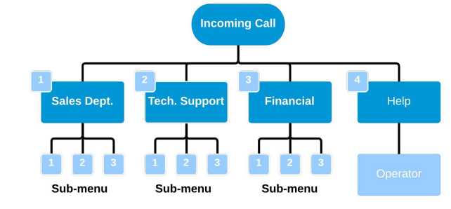
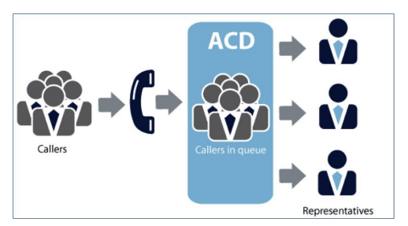

# Fusion Communication Systems

Description of the features of contact center software

## Fusion Communication Systems: changes the Conversation

In response to the challenges of new compliance requirements, sophisticated user demands,
increasing levels of information, network complexity and a highly competitive market, enterprises
need to become more and more interactive. Besides, businesses today have to cope with the
“consumerization” of the enterprise and changes in the way people want to work.
Thus, communication has moved from being just another utility service to becoming a strategic
company asset. It becomes the driver to enable employees to the react at the speed of their business
and customers’ demands.

Fusion Communication Systems approach consists in helping Enterprises to change the
Conversation. Enabling conversation for enterprises is about breaking the boundaries in order to
allow multiparty, multi-devices and multimedia communications.
Effective communication is as essential to growing organizations as working capital and a strong
business plan, organizations need communications to be reliable and cost-effective.
Streamlined communications are critical in order to provide internal and external customers with a
seamless service that ensures efficiency and satisfaction. An investment in the right communication
systems and tools will produce both quick and on-going returns. It will support your strategic goals
and strengthen your competitive edge.

Fusion Communication Systems is the first company in Kenya to design and build customized
telecommunication solutions. With 10 years’ experience in building telephony solutions Fusion
creates solutions that are easy to use, easy to manage, scalable, reliable and deliver enterprise-class
features.

We are changing the face of IP telephony with our innovative line of systems. Our range of
telephony solutions can be used for a standard office solution and for a call center solution

## Why Fusion Communication?
With Fusion's communication solutions, you will achieve the following for your organization:
    * Reduce the costs of doing business with better managed communications
    * Improve organizational flexibility
    * Increase employee productivity
    * Accelerate your business pace
    * Improve customer satisfaction
And as your business grows, the Fusion systems will grow right along with you

## Fusion Systems Overview

### Highly Scalable
Designed to handle unlimited number of employees and cater for companies with basic telephony
needs to advanced corporations that have multiple branches. IP fusion is able to meet the demands
of any business environment.

Fusion can run on standard servers, virtual machines and fully on the Cloud the system is not
dependent on proprietary purpose built hardware. This provides flexibility and ensures the system
as a whole will never become obsolete since individual components can be replaced or added as
needed with the latest components in the future. This is the last business phone system your
company will ever need.

### Reliable
Fusion is build using an open architecture, with our inbuilt monitoring and reporting tools your
system is proactively monitored and maintained around the clock

### Affordable
With prices 50 to 80 percent less than competitive solutions even the smallest business can
afford a feature rich phone system

### Fully supported by 24/7 technical support
Due to the advanced monitoring and maintenance tools inbuilt within IP fusions our technical
support team can offer remote round the clock support.

## Fusion Call Manager
Fusion systems is a software based call manager system which runs on standard servers. IP Fusion runs
on an optimized version of Linux distro. The primary purpose of building on Linux is because it is
inherently built with emphasis on reliability, stability and security. The open nature of the code
means that we can optimize it for the rigorous environment which is telecommunication.

Fusion Call manager is the core that interacts with all communication modules. IP Fusion call
manager is built to be a Swiss Army Knife of Telephony, the system is built with the primary
purpose of being an engine for building Real Time Communication systems and applications.

# Call Manager System Functionality
## Auto-Attendant/ Interactive Voice Response
Auto-Attendant offers a menu system that allows callers to be transferred to an extension without
going through a telephone operator or receptionist. The auto-attendant is also known as a digital
receptionist.

The IVR or auto-attendant provides a flow for your callers once the call is received for example
"press 1 for sales" or "press 2 for support". Allowing for skill based routing where the caller is
directed to the most capable person to handle their request.

Using our convenient web based interface, you can easily set up basic or more complex voice menu's
to help your callers to the right destination.

For a caller to find a user on a phone system, a dial-by-name directory is usually available. This
feature lists users by name, allowing the caller to press a key to automatically ring the extension of a
user once his/her extension is announced by the auto attendant.

## Automatic Call Distribution (ACD)
With ACD, employees (agents) log into a queue group so they can answer calls for a specific
department. Incoming calls are routed into the appropriate queue, and the calls are distributed to the
agents logged into that queue. ACD queuing is a critical business function, especially for call
centers, and needs to be as robust and feature-rich as possible to allow the maximum flexibility for
your company.

Many suppliers simply route calls to a list of names (a hunt group) and call it ACD queuing
leaving customers with incomplete and frustrating systems. IP Fusion offers the most
sophisticated ACD capability which offers a whole list of advanced features, such as:

### Even load distribution
Fusion system queuing includes the ability to guarantee an even distribution of calls across all agents logged
into an ACD queue. We keep track of how long it has been since the agent last received a call, and
route the next call to the person who has been off the phone the longest time.

### Self-managed agent presence
Managing ACD queues can be complex and time consuming for administrators. With most systems, 
administrators must keep track of who is working, when employees go on breaks, when someone
comes in late, etc. IP Fusion queuing allows employees to log themselves in and out of queues, and
the system dynamically and automatically adjusts call routing appropriately. Administrators never
have to be involved in the process. Management can monitor queue and employee activity, in real
time, but they don’t have to re-configure the system with every employee change.

## Skills-based Routing
This feature allows administrators to rank employees in ACD queues by how skilled they are, or by
the priority the employees should have in answering calls.

You can set the rank of the most skilled agents to the highest level, and decrease the ranking for
those with lesser skills. When a call arrives, the IP Fusion call manager system knows which agents
are already assisting customers, and the incoming call is routed automatically to the highest-ranked
available agent. This ensures that the most skilled agents take the most calls. New employees in
training can be ranked at the lower levels, allowing them to help when the need is great but giving
them more time to learn from peers.

### Call waiting signal
Sometimes employees in queues can chat because the phone lines aren’t busy. IP Fusion signals all
queue members whenever there are callers waiting, so the agents know that they should wrap up
their current calls in a businesslike fashion so they can help the next caller. There’s never a case
where an employee doesn’t know people are waiting.

### Custom on-hold information
Fusion system gives you the option to play music from a broad selection of styles while callers wait, or
to play a custom informational or promotional message. The music and message can be different
from queue to queue and you get wide flexibility in when to use the recordings.

### Real time queue monitoring
Effective management of a call center often means knowing what is happening all the time. How
many callers are waiting? How long is the wait time? How many employees are actively answering
calls for each queue? These questions and more can be answered in real-time through our
sophisticated queue monitoring tools. Part of our management suite, these tools allow managers to 
see exactly what is happening with any agent. Whether employees are located in the same facility as
the manager or telecommute from remote/branch offices, management can monitor activity levels
and ensure that calls are being taken in an efficient manner.

By monitoring call activity, managers can move assets from one ACD queue to another as
needed, or know when they need to get extra help. Real-time queue monitoring will improve
your business response and efficiency.

### Agent wrap-up time
In a busy call center, agents often find their phones ringing as soon as they hang up from the
previous call. With IP Fusion Queue Wrap-up Time, queue administrators can give agents time to
finish details from the last call before the phone rings again. The amount of time can be
customized for each queue.

## Agent Web Interface
Fusion System agent module offers web browser agent screen that can be customized and controlled
using a powerful set of tools available within the call center software. An extremely sophisticated
Script Builder for creation of scripts with custom variables and embedded URL like any web
enabled CRM or web-sites. Custom disposition or wrap-up codes as well as custom DND codes
allow for detailed reporting of agent activity.

### Agent Web Screen Features
* Configurable Agent Screen
* Customizable Screen Layout and Contents
* Customizable Wrap codes / Disposition
* Custom Break/DND codes
* Transfers (Blind/3-way/Consultative)
* Multi-page scripts
* Client - Info and Incoming Call Details 

## Desktop Agent/Softphone
Fusion System uses java based a desktop client. It provides a full integration with the Call manager
from viewing extensions all the way through to a full queue interface. 

Our agent is very easy to use and provisions out in a flash with our server provisioning tools. The
desktop clients further provides a built in SIP client and XMPP integration. This allows users to chat,
transfer files, video call and video conference from their desktop.

The capabilities of each client user are based on administrator rights set during deployment

## Call Detail Records
Fusion System has a powerful and detailed call reporting platform which provides detailed reports on all
phone calls made within the system, this includes reports on all incoming calls, outgoing calls by
user, conference calls and user login reports. The reports can be customized to fit your specific
organizational needs. This report includes:

* the phone number of the subscriber originating the call (calling party)
* the phone number/ extension or agent receiving the call (called party)
* the starting time of the call (date and time)
* the call duration
* the identification of the telephone exchange or equipment writing the record
* a unique sequence number identifying the record
* the disposition or the results of the call, indicating, for example, whether or not the call was connected
* the route by which the call entered the exchange
* the route by which the call left the exchange
* any fault condition encountered
* Call hold duration

## Call Recording
Fusion System call recording functionality is able to continually record 100% of all calls or record ondemand. All calls are digitally recorded and capture and store for every agent and customer interaction regardless of the source, destination or service (ISDN, VoIP, and Mobile). Calls are recorded to a hard drives and can be instantly found, accessed and replayed.

* Resolve customer disputes
* Ensure regulatory compliance
* Meet legal obligations
* Improve customer service
* Increase employee productivity
* Address security concerns
* Record phone calls automatically or on-demand

## Music on hold & Music on transfer
While your customers are waiting, provide them some music. It's as easy as uploading an MP3 file
using the IP fusion web administration interface. You can upload as much files as you like, any time
a caller is put on hold, alone in a conference room or waiting in a call queue the music

## Predictive Dialer
Using a pre-loaded list of numbers, IP Fusion quickly and automatically places outbound calls
and connects the answered calls to available agents. IP Fusion monitors the call center volume
and time per call, intelligently adjusting its dial rate to minimize the time your agents spend
waiting between conversations.

Our predictive dialer also allows the dialing campaign manager to manually increase and
decrease the amount of inbound and outbound calls on the fly, optimizing call center
productivity every day.

The IP Fusion Predictive Dialer utilizes sophisticated algorithms to speed up and slow down the call
rate based on, number of available agents, number of available lines, the campaign's average call time
and other statistical information.

## Voicemail System
A complete voicemail system is integrated in the fusion call manager server. It includes multiple
delivery options for your voicemail messages: telephone access using a voice menu, automated email delivery with attachment or web based accessibility. You can also organize voicemail
messages in multiple folders for easy retrieval. Additionally, many IP phones will alert you
immediately when a new voicemail message arrives.

## Flexible Extension Logic
* Unified dial plan—any phone can dial any other phone by extension number, regardless of location
* An incoming call may simultaneously ring more than one telephone
* An incoming call may serially ring extensions to find an employee
* An incoming call may be forwarded to any other number (including a cell phone) 

## Conferencing
Conferencing has never been easier; thanks to IP fusion integrated Conference Bridge. You can
easily set up a conference with internal users, or invite external people to join your conference.
Our web based interface or * key on your telephone lets you easily control your conference. The
number of participants is only limited by the number of phone lines you have available

## Call Scheduler (Call Forwarding Based on Time and Day)
Call Scheduler allows you to pre-schedule call treatments based on time and dates parameters. When
a call comes in the system checks to see if call schedule parameters apply the call is then forwarded
either to an extension, voicemail box, recorded message or even to an external mobile number.

## Call Center Scripting
Whether the contact centre handles customer service, support or sales inquiries, one thing is certain
customers expect accurate, complete and personalized service.

Our contact centre system provides is a powerful, yet easy-to-use tool that’s designed to help guide
agent dialogue while interacting with customers to deliver a more consistent and enhanced
experience. Scripting greatly expands your inbound and outbound capabilities and positively impacts
your bottom line.

* Increase revenue opportunities through cross-sell and up-sell efforts
* Easily create and deploy sophisticated scripts without the need for IT assistance
* Rapidly adapt existing campaigns to changing business requirements; make edits on the fly
* Allows Supervisors to set operational rules, manage required fields, automate validation and provide agents access to information from external data sources
* Reduce agent training costs and improve call metrics
* Ensure adherence to internal processes and compliance requirements
* Enhance brand image through consistent messaging

## Summary and List of Features
* Ability for an agent to call clients in succession from a database through a web-client
* Ability to display a script for the agent to read with fields like name, address, etc. filled-in
* Ability to set a campaign to auto-dial and send live calls to available agents
* Ability to dial predictively in a campaign with an adaptive dialing algorithm
* Ability to open a custom web page with user data from the call, per campaign
* Ability to autodial campaigns to start with a simple IVR then direct to agent
* Ability to broadcast dial to customers with a pre-recorded message
* Ability to park the customer with custom music per campaign
* Ability to send a dropped call to a voicemail box per campaign if no agent is available
* Ability to set outbound CallerID per campaign
* Ability to take inbound calls grabbing CallerID
* Ability to function as an ACD for inbound and fronter/closer verification calls
* Ability to have an agent take both inbound and outbound calls in one session(blended)
* Ability to start and stop recording an agent's calls at any time
* Ability to automatically record all calls
* Ability to manually or automatically call up to two other customer numbers for the same lead
* Automatically dial unlimited numbers per customer until you get an answer
* Ability to schedule a callback with a customer as either any-agent or agent-specific
* Ability in Manual dial mode to preview leads before dialing
* Ability for agents to be logged in remotely anywhere with just a phone and a web browser
* Faster hang-up and dispositioning of calls with one key press (Hotkeys)
* Definable Agent Wrap up-time per campaign
* Ability to add custom call dispositions per campaign
* Ability to use custom database queries in campaign dialing
* Recycling of specified status calls at a specified interval without resetting a list
* Dialing with custom Time Zone restrictions including per state and per day-of-the-week
* Dialing with Answering Machine Detection, also playing a message for AM calls
* Multiple campaigns and lead-lists are possible
* Option of a drop timer with safe-harbor message for FTC compliance
* Variable drop call percentage when dialing predictively for FTC compliance
* Internal DNC list can optionally be activated per campaign
* All calls are logged and statuses of calls are logged as well as agent time breakdowns
* Several real-time and summary reports available
* Real-time campaign display screens
* 3rd party conferencing
* 3rd party blind call transfer
* 3rd party conferencing with agent drop-off
* Custom Music-On-Hold and agent alert sound for inbound calls
* Estimated hold time, place in line, overflow queues and several other inbound-only features
* Skills-based ranking and call routing per inbound group(queues) and campaign
* Queue Prioritization per campaign and inbound group
* Single agent call queuing
* Ability to set user levels and permissions for certain features and campaigns
* Ability for managers to listen-in on agent conversations
* Ability for managers to enter conversations with agents and customers
* Ability for agents to select a Pause Code when they are not active
* Ability for agents to control volume levels and mute themselves
* Agent shift enforcement by day and time, defined per user group
* click-to-dial outside of the agent screen
* Lead import web-based API
* Web-based data export utilities
* Separate Time-clock application to track user work time
* Web-based administration
* DID, phone and carrier trunk provisioning through the web interface. 