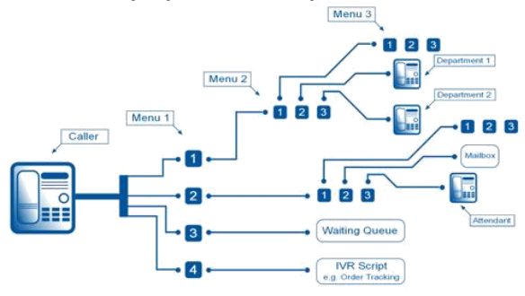

# Fusion Communication Systems

Description of the features of contact center software

## Fusion Communication Systems: changes the Conversation

In response to the challenges of new compliance requirements, sophisticated user demands,
increasing levels of information, network complexity and a highly competitive market, enterprises
need to become more and more interactive. Besides, businesses today have to cope with the
“consumerization” of the enterprise and changes in the way people want to work.
Thus, communication has moved from being just another utility service to becoming a strategic
company asset. It becomes the driver to enable employees to the react at the speed of their business
and customers’ demands.

Fusion Communication Systems approach consists in helping Enterprises to change the
Conversation. Enabling conversation for enterprises is about breaking the boundaries in order to
allow multiparty, multi-devices and multimedia communications.
Effective communication is as essential to growing organizations as working capital and a strong
business plan, organizations need communications to be reliable and cost-effective.
Streamlined communications are critical in order to provide internal and external customers with a
seamless service that ensures efficiency and satisfaction. An investment in the right communication
systems and tools will produce both quick and on-going returns. It will support your strategic goals
and strengthen your competitive edge.

Fusion Communication Systems is the first company in Kenya to design and build customized
telecommunication solutions. With 10 years’ experience in building telephony solutions Fusion
creates solutions that are easy to use, easy to manage, scalable, reliable and deliver enterprise-class
features.

We are changing the face of IP telephony with our innovative line of systems. Our range of
telephony solutions can be used for a standard office solution and for a call center solution

## Why Fusion Communication?
With Fusion's communication solutions, you will achieve the following for your organization:
    * Reduce the costs of doing business with better managed communications
    * Improve organizational flexibility
    * Increase employee productivity
    * Accelerate your business pace
    * Improve customer satisfaction
And as your business grows, the Fusion systems will grow right along with you

## Fusion Systems Overview

### Highly Scalable
Designed to handle unlimited number of employees and cater for companies with basic telephony
needs to advanced corporations that have multiple branches. IP fusion is able to meet the demands
of any business environment.

Fusion can run on standard servers, virtual machines and fully on the Cloud the system is not
dependent on proprietary purpose built hardware. This provides flexibility and ensures the system
as a whole will never become obsolete since individual components can be replaced or added as
needed with the latest components in the future. This is the last business phone system your
company will ever need.

### Reliable
Fusion is build using an open architecture, with our inbuilt monitoring and reporting tools your
system is proactively monitored and maintained around the clock

### Affordable
With prices 50 to 80 percent less than competitive solutions even the smallest business can
afford a feature rich phone system

### Fully supported by 24/7 technical support
Due to the advanced monitoring and maintenance tools inbuilt within IP fusions our technical
support team can offer remote round the clock support.

## Fusion Call Manager
Fusion systems is a software based call manager system which runs on standard servers. IP Fusion runs
on an optimized version of Linux distro. The primary purpose of building on Linux is because it is
inherently built with emphasis on reliability, stability and security. The open nature of the code
means that we can optimize it for the rigorous environment which is telecommunication.

Fusion Call manager is the core that interacts with all communication modules. IP Fusion call
manager is built to be a Swiss Army Knife of Telephony, the system is built with the primary
purpose of being an engine for building Real Time Communication systems and applications.

# Call Manager System Functionality
## Auto-Attendant/ Interactive Voice Response
Auto-Attendant offers a menu system that allows callers to be transferred to an extension without
going through a telephone operator or receptionist. The auto-attendant is also known as a digital
receptionist.

The IVR or auto-attendant provides a flow for your callers once the call is received for example
"press 1 for sales" or "press 2 for support". Allowing for skill based routing where the caller is
directed to the most capable person to handle their request.

Using our convenient web based interface, you can easily set up basic or more complex voice menu's
to help your callers to the right destination.

For a caller to find a user on a phone system, a dial-by-name directory is usually available. This
feature lists users by name, allowing the caller to press a key to automatically ring the extension of a
user once his/her extension is announced by the auto attendant.

## Automatic Call Distribution (ACD)
With ACD, employees (agents) log into a queue group so they can answer calls for a specific
department. Incoming calls are routed into the appropriate queue, and the calls are distributed to the
agents logged into that queue. ACD queuing is a critical business function, especially for call
centers, and needs to be as robust and feature-rich as possible to allow the maximum flexibility for
your company.

Many suppliers simply route calls to a list of names (a hunt group) and call it ACD queuing
leaving customers with incomplete and frustrating systems. IP Fusion offers the most
sophisticated ACD capability which offers a whole list of advanced features, such as:

### Even load distribution
Fusion system queuing includes the ability to guarantee an even distribution of calls across all agents logged
into an ACD queue. We keep track of how long it has been since the agent last received a call, and
route the next call to the person who has been off the phone the longest time.

### Self-managed agent presence
Managing ACD queues can be complex and time consuming for administrators. With most systems, 
administrators must keep track of who is working, when employees go on breaks, when someone
comes in late, etc. IP Fusion queuing allows employees to log themselves in and out of queues, and
the system dynamically and automatically adjusts call routing appropriately. Administrators never
have to be involved in the process. Management can monitor queue and employee activity, in real
time, but they don’t have to re-configure the system with every employee change.

## Skills-based Routing
This feature allows administrators to rank employees in ACD queues by how skilled they are, or by
the priority the employees should have in answering calls.

You can set the rank of the most skilled agents to the highest level, and decrease the ranking for
those with lesser skills. When a call arrives, the IP Fusion call manager system knows which agents
are already assisting customers, and the incoming call is routed automatically to the highest-ranked
available agent. This ensures that the most skilled agents take the most calls. New employees in
training can be ranked at the lower levels, allowing them to help when the need is great but giving
them more time to learn from peers.

### Call waiting signal
Sometimes employees in queues can chat because the phone lines aren’t busy. IP Fusion signals all
queue members whenever there are callers waiting, so the agents know that they should wrap up
their current calls in a businesslike fashion so they can help the next caller. There’s never a case
where an employee doesn’t know people are waiting.

### Custom on-hold information
Fusion system gives you the option to play music from a broad selection of styles while callers wait, or
to play a custom informational or promotional message. The music and message can be different
from queue to queue and you get wide flexibility in when to use the recordings.

### Real time queue monitoring
Effective management of a call center often means knowing what is happening all the time. How
many callers are waiting? How long is the wait time? How many employees are actively answering
calls for each queue? These questions and more can be answered in real-time through our
sophisticated queue monitoring tools. Part of our management suite, these tools allow managers to 
see exactly what is happening with any agent. Whether employees are located in the same facility as
the manager or telecommute from remote/branch offices, management can monitor activity levels
and ensure that calls are being taken in an efficient manner.

By monitoring call activity, managers can move assets from one ACD queue to another as
needed, or know when they need to get extra help. Real-time queue monitoring will improve
your business response and efficiency.

### Agent wrap-up time
In a busy call center, agents often find their phones ringing as soon as they hang up from the
previous call. With IP Fusion Queue Wrap-up Time, queue administrators can give agents time to
finish details from the last call before the phone rings again. The amount of time can be
customized for each queue.

